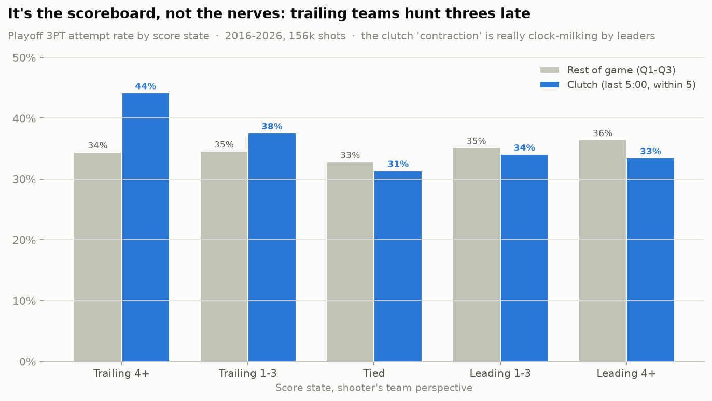

# Shot Selection Under Pressure 🏀🧠

> How does high-stakes pressure affect NBA shot selection?

## Hypothesis

In high-stakes moments, players deviate from their normal shot selection:

- **Low stakes** (early quarters, comfortable margins): players shoot their natural
  mix, including plenty of 3-pointers
- **High stakes** (4th quarter, last 5 minutes, score within 5): players **contract**
  — fewer 3s, more mid-range jumpers and drives

The size of that contraction is a behavioral proxy for composure — the ability to
keep playing your game when it matters most.

## Two analyses, one surprise

### 1. The motivating case study — 2026 Finals (Spurs vs Knicks)

Full findings: **[outputs/REPORT.md](outputs/REPORT.md)**. This is the series that
started the project, and it looks like a clean confirmation:

- Pooled across both teams, the 3PT attempt rate fell from **43.8%** in non-clutch
  Finals minutes to **30.9%** in the clutch (−12.9 pp, Fisher exact p = 0.041).
- The slack went to the **mid-range**: San Antonio took 4.6% of its shots from
  mid-range in Q1–Q3 and **26.5%** in the clutch.
- Player-level: rookie Dylan Harper contracted the most (39% → **0%**), while
  Victor Wembanyama's mix barely moved (33.0% → 33.3%).


### 2. The reality check — every playoff game, 2016–2026

Full findings: **[outputs/MULTISEASON_REPORT.md](outputs/MULTISEASON_REPORT.md)**.
Scaling the exact same test to **919 playoff games / 156k shots** overturns the
naive hypothesis:

- League-wide, the clutch 3PT shift is **+1.2 pp** — if anything players shoot
  *slightly more* threes when it matters. The 2026 Finals contraction was one of
  only a handful of seasons that bucked the trend.
- **The confound:** "clutch" averages opposite behaviors. Teams **trailing 4+**
  hunt threes (44% vs 34% normally); teams **leading** milk clock for safe twos.
  A single close game you watch is dominated by the leader's clock management, so
  it *looks* like everyone abandons the arc.
- **Controlled test:** hold score state constant (tied games) and the pressure
  effect vanishes (−1.5 pp, p ≈ 0.45). Composure, measured by shot selection,
  barely moves once you account for the scoreboard.



**Takeaway:** the eye-test hypothesis is real *for some games* but wrong *as a
general law*. You can't read a player's "mindset maturity" off one high-stakes
game without controlling for score and clock.

## Data sources

Direct NBA/ESPN APIs are often blocked from cloud environments, so the pipeline
pulls from two GitHub mirrors instead (both fetched automatically, cached in
`data/raw/`):

| Source | Used for | Contents |
|---|---|---|
| [`sportsdataverse/hoopR-nba-raw`](https://github.com/sportsdataverse/hoopR-nba-raw) | Finals + all 2016–2026 playoff games | Raw ESPN play-by-play JSON per game (shot text, clock, running score, coordinates), updated nightly |
| [`shufinskiy/nba_data`](https://github.com/shufinskiy/nba_data) | Regular-season baselines | stats.nba.com shot-chart detail per season (official shot zones) |

**Clutch definition** (NBA.com standard): 4th quarter or OT, last 5:00, score
within 5 points — margin measured *before* the shot.

## Getting started

```bash
python3 -m venv .venv
source .venv/bin/activate
pip install -r requirements.txt

python run_analysis.py       # 2026 Finals case study -> REPORT.md + charts 01-03
python run_multiseason.py    # 2016-2026 playoffs (~1GB download, cached)
                             #   -> MULTISEASON_REPORT.md + charts 04-05
pytest tests/                # unit tests for parsing, clutch & state labelling
```

Outputs land in `outputs/` (charts + reports) and `data/processed/` (aggregate
tables). `run_multiseason.py` caches the parsed 156k-shot table under `data/raw/`
so re-runs are instant.

## Project structure

```
shot-selection-under-pressure/
├── data/
│   ├── raw/            # cached downloads (gitignored)
│   └── processed/      # per-shot table + aggregates (committed)
├── notebooks/          # exploratory notebooks (nba_api-based; needs direct API access)
├── src/
│   ├── data/           # fetch.py (mirrors + batch download), parse.py (pbp -> shots)
│   ├── features/       # pressure.py (clutch labelling)
│   ├── analysis/       # shot_mix.py (Finals) + league.py (score state, confound, tests)
│   └── visualization/  # charts.py
├── outputs/            # charts + REPORT.md + MULTISEASON_REPORT.md (committed)
├── tests/
├── run_analysis.py     # 2026 Finals case study
└── run_multiseason.py  # 2016-2026 league-wide test
```

## Caveats & next steps

The multi-season analysis already resolves the biggest caveat of the single
series — small sample — and surfaces the score-state confound. What it does **not**
yet isolate is genuine composure *within* a fixed situation at the player level:
the per-player table still mixes in which score states each player tends to shoot
in. A cleaner next step is a within-player, situation-matched model (e.g. shot
value ~ player × pressure, controlling for score state, shot clock, and defender
distance) so "pressure profiles" reflect decision-making rather than game context.
Adding regular-season clutch minutes would roughly 5× the clutch sample again.

## License

MIT
