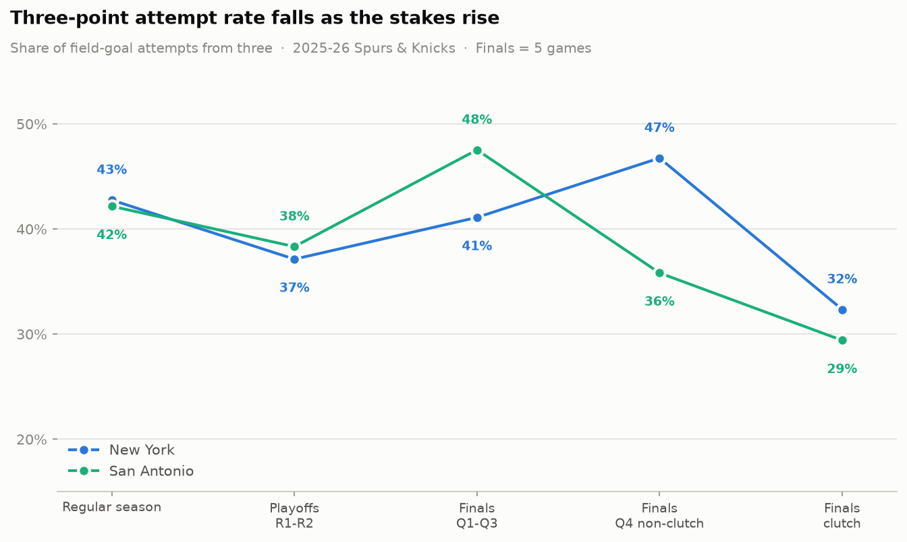

# Shot Selection Under Pressure 🏀🧠

> How does high-stakes pressure affect NBA shot selection?

## Hypothesis

In high-stakes moments, players deviate from their normal shot selection:

- **Low stakes** (early quarters, comfortable margins): players shoot their natural
  mix, including plenty of 3-pointers
- **High stakes** (4th quarter, last 5 minutes, score within 5): players **contract**
  — fewer 3s, more mid-range jumpers and drives

The size of that contraction is a behavioral proxy for composure — the ability to
keep playing your game when it matters most.

## Case study: 2026 NBA Finals (Spurs vs Knicks, NY won 4-1)

Full findings: **[outputs/REPORT.md](outputs/REPORT.md)**. Headlines:

- Pooled across both teams, the 3PT attempt rate fell from **43.8%** in non-clutch
  Finals minutes to **30.9%** in the clutch (−12.9 pp, Fisher exact p = 0.041).
- The slack went to the **mid-range**: San Antonio took 4.6% of its shots from
  mid-range in Q1–Q3 and **26.5%** in the clutch.
- Player-level: rookie Dylan Harper contracted the most (39% → **0%**, 0-of-7 threes
  in clutch FGA), while Victor Wembanyama's mix barely moved (33.0% → 33.3%).



## Data sources

Direct NBA/ESPN APIs are often blocked from cloud environments, so the pipeline
pulls from two GitHub mirrors instead (both fetched automatically, cached in
`data/raw/`):

| Source | Used for | Contents |
|---|---|---|
| [`sportsdataverse/hoopR-nba-raw`](https://github.com/sportsdataverse/hoopR-nba-raw) | Finals games | Raw ESPN play-by-play JSON per game (shot text, clock, running score, coordinates), updated nightly |
| [`shufinskiy/nba_data`](https://github.com/shufinskiy/nba_data) | Baselines | stats.nba.com shot-chart detail per season (official shot zones) |

**Clutch definition** (NBA.com standard): 4th quarter or OT, last 5:00, score
within 5 points — margin measured *before* the shot.

## Getting started

```bash
python3 -m venv .venv
source .venv/bin/activate
pip install -r requirements.txt

python run_analysis.py   # downloads data, writes tables + charts + report
pytest tests/            # unit tests for parsing & clutch labelling
```

Outputs land in `outputs/` (charts + `REPORT.md`) and `data/processed/` (per-shot
table and aggregates).

## Project structure

```
shot-selection-under-pressure/
├── data/
│   ├── raw/            # cached downloads (gitignored)
│   └── processed/      # per-shot table + aggregates (committed)
├── notebooks/          # exploratory notebooks (nba_api-based; needs direct API access)
├── src/
│   ├── data/           # fetch.py (GitHub mirrors), parse.py (ESPN pbp -> shots)
│   ├── features/       # pressure.py (clutch labelling)
│   ├── analysis/       # shot_mix.py (aggregations, Fisher tests, baselines)
│   └── visualization/  # charts.py
├── outputs/            # charts + REPORT.md (committed)
├── tests/
└── run_analysis.py     # end-to-end entry point
```

## Caveats & next steps

One five-game series is a case study, not proof: clutch defense, late-game lineups,
and intentional strategy (fouling, clock-milking) all depress 3PT rate for
non-psychological reasons. Next step is running the same pipeline across many
playoff series and regular-season clutch minutes to build per-player "pressure
profiles" with real sample sizes.

## License

MIT
