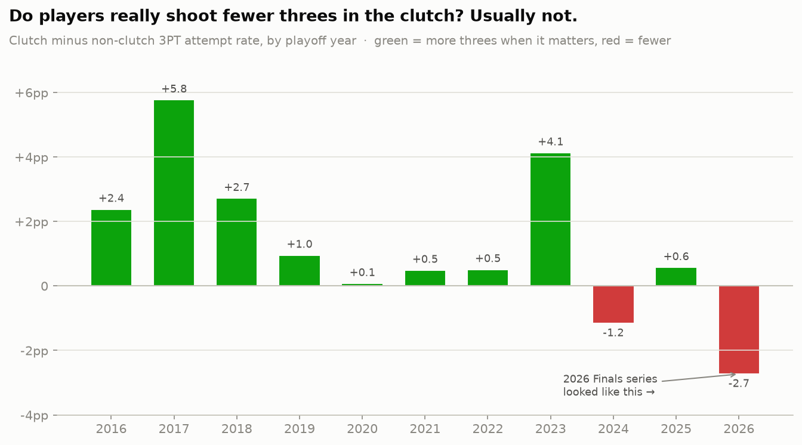

# Does the clutch three-point 'contraction' generalize? — 2016-2026 playoffs

Pooled across **919 playoff games** and **156,431 field-goal attempts** (ESPN play-by-play via hoopR-nba-raw).

## The short answer: no.

The 2026 Spurs-Knicks Finals looked like a clean confirmation — 3PT
attempt rate fell 12.9 points in the clutch. But across a decade of
playoffs the league-wide clutch shift is **+1.2 pp** (clutch 36.6% vs non-clutch 35.4%) —
if anything players shoot *slightly more* threes when it matters, not fewer.

Only a few playoff years show the contraction the eye test expects; the
2026 Finals was one of them, which is exactly why it was memorable — it
was atypical, not representative.

## Why single games fool us: the score-state confound

'Clutch' averages together two opposite behaviors. Split late-game shots by
the score before the shot and the illusion dissolves:

| Score state (shooter's team) | Rest of game | Clutch | Change |
|---|---|---|---|
| Trailing 4+ | 34.4% (42,032) | 44.2% (1,021) | +9.7 pp |
| Trailing 1-3 | 34.6% (16,458) | 37.6% (1,573) | +3.0 pp |
| Tied | 32.8% (7,636) | 31.4% (704) | -1.5 pp |
| Leading 1-3 | 35.2% (15,320) | 34.1% (1,359) | -1.1 pp |
| Leading 4+ | 36.4% (37,116) | 33.5% (699) | -3.0 pp |

Teams **trailing by 4+** jack up threes in the clutch (44% vs 34% normally)
— they need points fast. Teams **leading** shoot slightly fewer, milking
clock for safe twos. A single close game you happen to watch is dominated
by the *leading* team's clock-milking, so it *looks* like everyone abandons
the three.

## The clean composure test

Hold score state constant — compare clutch shots to early-game shots at the
*same* closeness — and the pressure effect essentially vanishes:

| Closeness band | Early (Q1-Q3) | Clutch | Shift | Fisher p |
|---|---|---|---|---|
| Tied | 32.8% (7,636) | 31.4% (704) | -1.5 pp | 0.45 |
| Within 3 | 34.5% (39,414) | 35.1% (3,636) | +0.6 pp | 0.48 |
| Within 5 | 34.5% (56,726) | 36.6% (5,356) | +2.1 pp | 0.00 |

The tightest control — **tied** games — shows no contraction (-1.5 pp,
p≈0.45). The looser *Within 5* band turns significant-positive only because
it starts leaking the trailing-team three-hunting back in (a team down 5 is
already in catch-up mode). The cleaner the control, the more completely the
pressure effect disappears: under pressure, playoff players shoot threes at
their normal rate. The 'mindset contraction' is mostly strategy (clock and
score), not nerves.

## Player tendencies (still confounded)

Among players with ≥60 clutch playoff FGA, biggest gaps between clutch and
non-clutch 3PT rate (this still mixes in which score states each player
shoots in, so read it as tendency, not certified composure):

| Player | Clutch FGA | Non-clutch 3PT | Clutch 3PT | Shift |
|---|---|---|---|---|
| Donovan Mitchell | 93 | 34.9% | 23.7% | -11.2 pp |
| Giannis Antetokounmpo | 65 | 13.8% | 9.2% | -4.6 pp |
| Pascal Siakam | 63 | 22.1% | 17.5% | -4.6 pp |
| Jayson Tatum | 99 | 30.9% | 27.3% | -3.7 pp |
| Damian Lillard | 71 | 40.7% | 38.0% | -2.7 pp |
| James Harden | 112 | 30.3% | 28.6% | -1.8 pp |
| Jamal Murray | 93 | 27.0% | 35.5% | +8.4 pp |
| Kawhi Leonard | 93 | 23.6% | 32.3% | +8.6 pp |
| Jimmy Butler III | 67 | 16.6% | 25.4% | +8.8 pp |
| Russell Westbrook | 68 | 27.8% | 38.2% | +10.5 pp |
| Kyrie Irving | 64 | 27.0% | 39.1% | +12.0 pp |
| Klay Thompson | 62 | 46.9% | 66.1% | +19.2 pp |

## Takeaway

The eye-test hypothesis is real *as a description of some games* but wrong
*as a general law*. What reads as pressure-induced conservatism is mostly
the leading team managing the clock. The interesting, defensible finding is
the **confound itself**: late-game shot selection is driven by the
scoreboard, and you cannot infer a player's 'mindset maturity' from a
single high-stakes game without controlling for it.