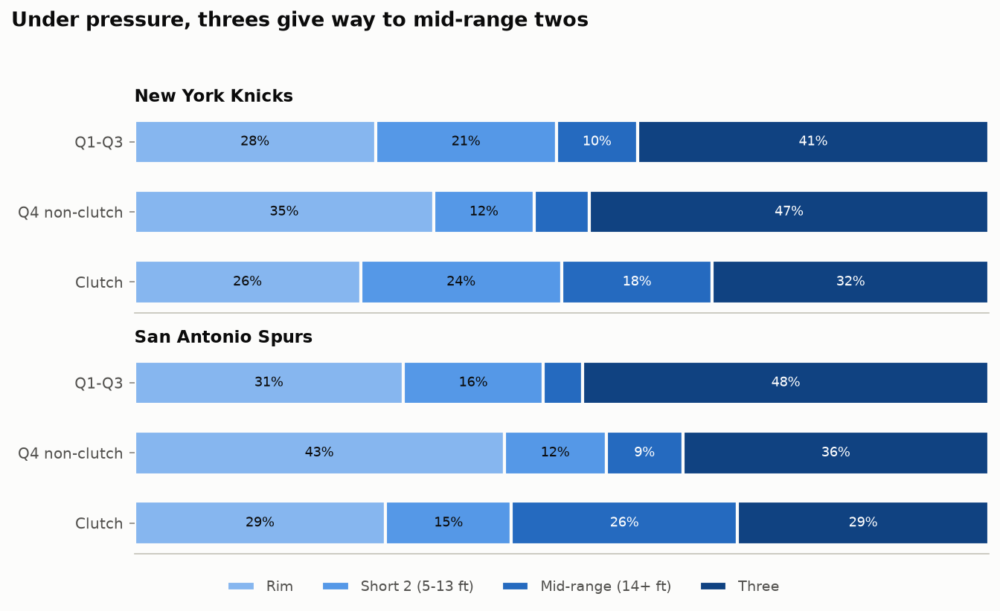
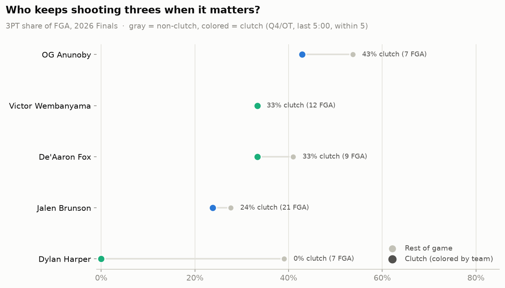

# Shot Selection Under Pressure — 2026 NBA Finals (Spurs vs Knicks)

**Hypothesis.** In high-stakes moments players abandon the three-point shot
they take freely in low-stakes minutes, contracting toward mid-range jumpers
and drives — a behavioral tell of pressure.

**Data.** All 862 field-goal attempts of the five 2026 Finals games
(ESPN play-by-play via `sportsdataverse/hoopR-nba-raw`), plus 2025-26
regular-season and pre-Finals playoff shot charts (stats.nba.com via
`shufinskiy/nba_data`) as baselines. *Clutch* = 4th quarter or OT, last
5:00, score within 5 points before the shot (NBA.com definition).

## 1. The stakes gradient

Three-point attempt rate (share of FGA) by stage:

| Stage | NY | SA |
|---|---|---|
| Regular season | 42.8% (7328 FGA) | 42.2% (7371 FGA) |
| Playoffs — R1-R2 | 37.1% (746 FGA) | 38.3% (681 FGA) |
| Finals — Q1-Q3 | 41.1% (326 FGA) | 47.5% (324 FGA) |
| Finals — Q4 non-clutch | 46.8% (77 FGA) | 35.8% (67 FGA) |
| Finals — clutch | 32.4% (34 FGA) | 29.4% (34 FGA) |

## 2. Clutch vs the rest of the Finals

| Group | Non-clutch 3PT rate | Clutch 3PT rate | Shift | Fisher p |
|---|---|---|---|---|
| SA | 45.5% (391) | 29.4% (34) | -16.1 pp | 0.074 |
| NY | 42.2% (403) | 32.4% (34) | -9.8 pp | 0.283 |
| Both teams | 43.8% (794) | 30.9% (68) | -12.9 pp | 0.041 |

## 3. Player-level shifts

Players with ≥6 clutch FGA in the series:

| Player | Team | RS 3PT rate | Finals non-clutch | Finals clutch | Shift |
|---|---|---|---|---|---|
| Dylan Harper | SA | 27.1% | 39.1% (64) | 0.0% (7) | -39.1 pp |
| OG Anunoby | NY | 50.6% | 53.7% (54) | 42.9% (7) | -10.8 pp |
| De'Aaron Fox | SA | 37.7% | 41.0% (61) | 33.3% (9) | -7.7 pp |
| Jalen Brunson | NY | 35.8% | 27.7% (112) | 23.8% (21) | -3.9 pp |
| Victor Wembanyama | SA | 32.4% | 33.0% (94) | 33.3% (12) | +0.4 pp |

## Caveats

- **Five games.** 68 clutch FGA total; only the pooled shift approaches
  conventional significance. This is a case study, not a league-wide result.
- **Defense is not held constant.** Clutch possessions face set half-court
  defenses that take away the arc; part of the shift is imposed, not chosen.
- **Lineups change late.** Coaches play their closers; the clutch shot mix
  partly reflects *who* shoots, not just *how* they choose.
- **Intentional strategy.** Trailing teams hunt quick 2s + fouls; leading
  teams milk clock into isolations. Both depress 3PT rate for reasons that
  are rational rather than psychological.

Next step: run the same pipeline over many playoff series (and regular-season
clutch minutes) so player-level 'pressure profiles' have real sample sizes.